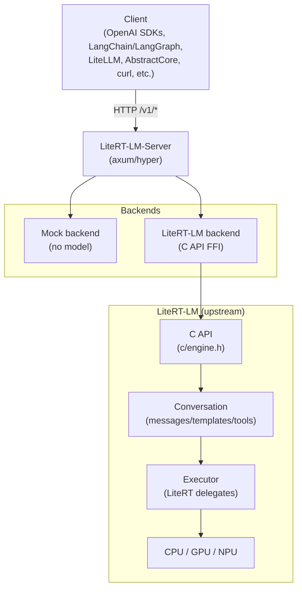
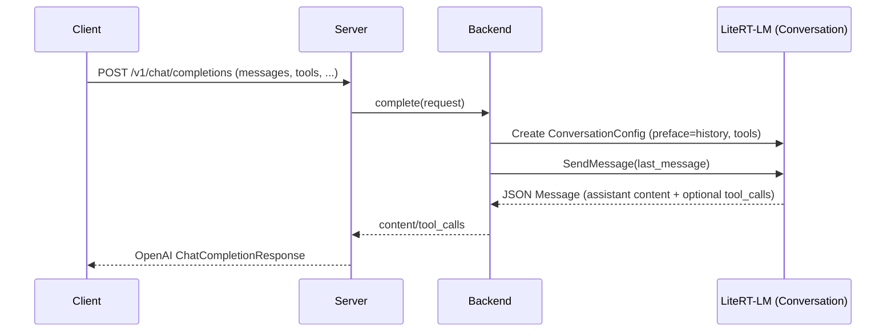
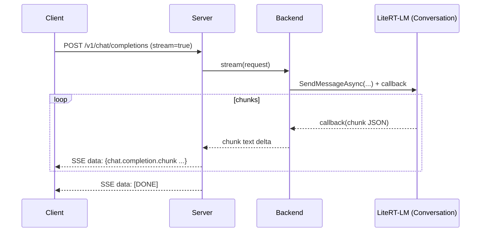
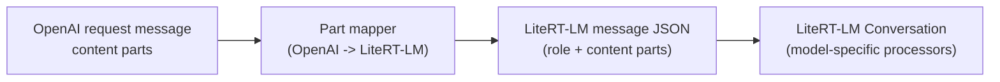
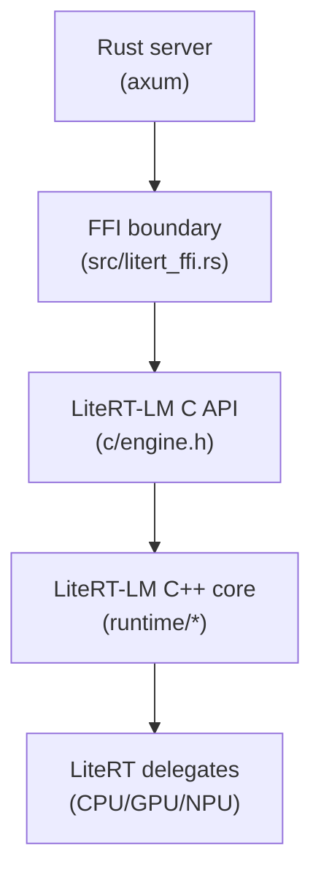

# Architecture

This doc describes how LiteRT-LM-Server maps OpenAI-style HTTP requests onto LiteRT-LM’s local inference APIs.

## 1) High-level view

## 2) Request lifecycle: `/v1/chat/completions`

### Non-streaming

### Streaming (SSE)

## 3) Multimodal mapping

LiteRT-LM expects message parts like:

- `{ "type": "text",  "text": "..." }`
- `{ "type": "image", "path": "..." }` or `{ "type": "image", "blob": "<base64>" }`
- `{ "type": "audio", "path": "..." }` or `{ "type": "audio", "blob": "<base64>" }`

This server accepts either:

1) those native parts directly, or
2) OpenAI-style parts like `image_url` (mapped into `image` parts).

## 4) FFI boundary

LiteRT-LM-Server stays Rust-only at the HTTP layer. Inference is delegated to LiteRT-LM via its C API.

